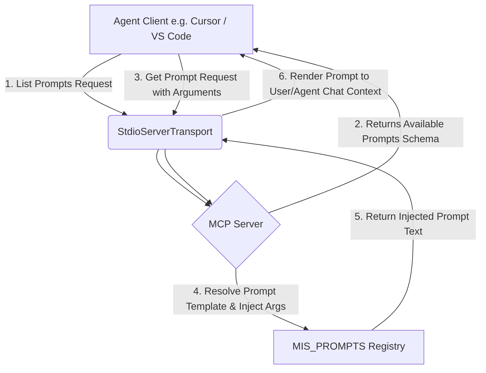

# 🛠️ dv-mcp-prompts

[](#)
[](#)
[](#)
[](#)

*An enterprise-grade Model Context Protocol (MCP) server engineered to inject high-performance development, architecture, technical SEO, and conversion-optimized prompts directly into agentic workflows.*

---

## 📖 CORE ABSTRACT & FUNCTIONAL OVERVIEW

### Technical Executive Summary
The modern development landscape increasingly relies on AI agents to scaffold, audit, and document complex codebases. However, without highly optimized, structured, and contextual prompts, these agents often produce generic, suboptimal boilerplate. 

`dv-mcp-prompts` is a custom Model Context Protocol (MCP) server designed to bridge this gap. By registering a suite of specialized, high-impact prompt templates, it equips developer agents (such as Cursor, VS Code, or custom MCP clients) with the precise directives needed to generate production-ready Next.js 15 / React 19 architectures, complete technical SEO audits, persuasive product showcases, and exhaustive system documentation. This eliminates prompt drift, ensures strict adherence to software engineering standards, and enforces high-performance business conversion rules.

### Key Features Matrix

| Icon | Key Feature Component | Core Business or Performance Impact |
| :---: | :--- | :--- |
| 🚀 | **Automated Project Initialization** | Standardizes Next.js 15 setup with type safety, dependency injection, and local agent pipeline scripts. |
| 🛍️ | **E-Commerce Architecture Generation** | Scaffolds Vertical-Sliced Next.js 15 e-commerce systems focusing on Web Vitals and spring animations. |
| 🔍 | **Technical SEO & SEM Audit** | Diagnoses hydration shocks, layout shifts (CLS), and crawlability bottlenecks with code-level replacement blueprints. |
| 🖼️ | **Persuasive Product Showcases** | Generates high-converting showcase pages leveraging the AIDA funnel framework and responsive iframe preview drawers. |
| 📄 | **Exhaustive README Generation** | Automatically writes technical, structured, and visually compelling documentation for any codebase niche. |
| 🗺️ | **Programmatic Metadata & Crawling** | Formulates dynamic SEO structures including Open Graph CTR canvases, `robots.ts`, and async `sitemap.ts`. |

---

## 🚀 ARCHITECTURAL RUNTIME FLOW

When an agentic client connects to `dv-mcp-prompts` via standard input/output (STDIO) transport, the interaction follows a deterministic sequence:



1. **Protocol Handshake & Discovery:** The client initiates a stdio transport handshake and calls the `ListPromptsRequestSchema` handler. The server replies with a list of all registered prompts (`MIS_PROMPTS`), details of their required/optional arguments, and their descriptions.
2. **Argument Injection & Rendering:** When a user or agent invokes a specific prompt (e.g., `/mcp:dv-prompts:readme-generator`), the client triggers `GetPromptRequestSchema` passing arguments. The server processes the template, dynamically injects the parameters, and returns the fully rendered Markdown prompt.

---

## 📁 COMMENTED ANNOTATED DIRECTORY TREE

```
dv-mcp-prompts/
├── .gitignore               # Excludes node_modules, compiled assets, and environment files.
├── dist/                    # Compiled production-ready JavaScript code (generated via tsc).
├── mcp_config.json          # Configuration file registering the local MCP server inside IDE settings.
├── package.json             # Core dependency manifest, script definitions, and metadata.
├── tsconfig.json            # Strict TypeScript compiler options and build output configuration.
└── src/                     # Core server source code.
    ├── server.ts            # Bootstraps the MCP Server, declares capabilities, and registers schema handlers.
    └── prompts/             # Modular prompt catalog (highly cohesive prompt template definitions).
        ├── cabuwebDetail.ts        # Persuasive, conversion-focused product showcase page generation prompt.
        ├── createEcommerce.ts      # Full e-commerce vertical slicing architecture scaffold prompt.
        ├── createProject.ts        # Next.js 15 clean scaffolding and agent script pipeline prompt.
        ├── readmeGenerator.ts      # Exhaustive README.md generator prompt.
        ├── seoPageArchitecture.ts  # Technical SEO metadata, Open Graph assets, and sitemap generation prompt.
        └── seoSemAudit.ts          # Advanced Core Web Vitals, indexation, and hydration shock audit prompt.
```

---

## 🛠️ TECHNICAL STACK & DEPENDENCY LAYER

### Production Dependencies

| Icon | Core Technology / Library | Strict Semantic Version | Explicit Project Purpose |
| :---: | :--- | :---: | :--- |
| 🛡️ | `@modelcontextprotocol/sdk` | `^1.29.0` | Enables standard MCP server connection, STDIO transport management, and prompt routing. |

### Development/Build Tooling Dependencies

| Icon | Core Technology / Library | Strict Semantic Version | Explicit Project Purpose |
| :---: | :--- | :---: | :--- |
| 📘 | `typescript` | `^7.0.2` | Implements type-safe code compilation and compilation checking. |
| 🟢 | `@types/node` | `^26.1.1` | Provides Node.js environment type signatures for compilation. |

---

## ⚙️ PROVISIONING & INFRASTRUCTURE EXECUTION GUIDE

### Prerequisites
- **Node.js:** `>= 20.0.0` (Recommended)
- **NPM:** `>= 10.0.0`

### Executable Code Blocks

#### 1. Repository Cloning
```bash
git clone https://github.com/DiegoVilla27/dv-mcp-prompts.git
cd dv-mcp-prompts
```

#### 2. Dependency Installation
```bash
npm install
```

#### 3. Compilation & Build
```bash
npm run build
```

#### 4. Development Local Execution
Start the MCP server locally in stdio transport mode:
```bash
npm start
```

#### 5. Integration with Cursor / VS Code
To integrate this server with your favorite AI-powered editor, add the following configuration to your global MCP settings (e.g., in Cursor under *Settings > Features > MCP*):

```json
{
  "mcpServers": {
    "dv-prompts": {
      "command": "node",
      "args": ["/absolute/path/to/dv-mcp-prompts/dist/server.js"]
    }
  }
}
```

---

## 📈 CORE WEB VITALS / ARCHITECTURAL RESILIENCE

As a pure Node.js command-line application using Model Context Protocol over standard I/O (stdio), `dv-mcp-prompts` maintains a zero-network runtime footprint during prompt generation. 
- **Error Boundaries:** The server implements robust try-catch mechanisms within the `GetPromptRequestSchema` request handler to intercept unknown prompt names gracefully and report user-friendly errors without crashing the main STDIO stream process.
- **Micro-Performance:** Prompt templates are structured as pure Javascript/TypeScript functions to ensure microsecond-level compilation and delivery of prompt texts.

---

## 🤝 CONTRIBUTION BOUNDS & LICENSE

1. **Fork the repository** and create your feature branch: `git checkout -b feature/amazing-prompt`.
2. **Adhere to the template structure** found in `src/prompts/`. Each prompt must export a cohesive config object matching the MCP prompt schema.
3. **Run build verification** via `npm run build` to guarantee zero compilation errors.
4. **Submit a Pull Request** mapping your changes clearly to outstanding issues.

Distributed under the **ISC License**. See `package.json` for details.

---

## ✒️ AUTHORSHIP & CREDITS

> This digital ecosystem has been designed, structured, and developed to high-performance standards by **[Cabuweb](https://cabuweb.com)**.
